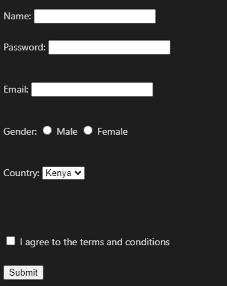

# HTML Assessment Test

### Instructions:

- Answer all questions.
- Each question is worth 10 marks.
- Write your answers clearly and concisely.
- For each practical test, create a separate file named according to the task. For example, for an HTML form, name the file html_form.html.

---

## Section 1: HTML Basics

1. **[10 marks]**  
   Explain the difference between HTML Tags and HTML Attributes. Provide an example to illustrate your explanation.

2. **[10 marks]**  
   Create an HTML file that contains a title, a heading (h1), and a paragraph describing the history of HTML.

---

## Section 2: HTML Formatting and Grouping

3. **[10 marks]**  
   List and explain any five HTML formatting tags. Provide an example of how each is used.

4. **[10 marks]**  
   Write HTML code that groups content into two sections: a block section using `<div>` and an inline section using `<span>`.

---

## Section 3: HTML Lists and Images

5. **[10 marks]**  
   Write an HTML snippet that creates an ordered list of three programming languages and an unordered list of three fruits.

   **Example:**

   Ordered list of programming languages:

   1. Python
   2. JavaScript
   3. Java

   Unordered list of fruits:

   - Apple
   - Banana
   - Orange

6. **[10 marks]**  
   Embed an image in an HTML file and include an image map with clickable regions. Explain what an image map is and how it can be used.

   **Example:**

   
   <map name="image-map">
     <area
       shape="rect"
       coords="34,44,270,350"
       href="page1.html"
       alt="Region 1"
     />
     <area
       shape="circle"
       coords="337,300,44"
       href="page2.html"
       alt="Region 2"
     />
   </map>

## Section 4: HTML Hyperlinks and Tables

7. **[10 marks]**  
   Write HTML code that creates a hyperlink to an external website and another hyperlink that navigates to a specific section within the same page.

8. **[10 marks]**  
   Create a table with 3 rows and 2 columns. In the first row, include table headers for "Name" and "Age". Fill in the remaining rows with example data.

   **Example:**

   ```markdown
   | Name  | Age |
   | ----- | --- |
   | John  | 25  |
   | Sarah | 30  |
   ```

9. **[10 marks]**
   Create an HTML table that demonstrates the use of both colspan and rowspan. The table should have:
    <ol>
    <li>A header that spans two columns (using colspan).</li>
    <li>A cell in the first column that spans two rows (using rowspan)</li>
    </ol>

   **Example:**

   ```markdown
   | Header 1 (colspan) | Header 2 |
   | ------------------ | -------- |
   | Rowspan (2 rows)   | Data 1   |
   |                    | Data 2   |
   ```

10. **[10 marks]**
    Explain what URL Encoding is and why it is important. Provide an example of a URL with special characters that need encoding.

## Section 5: HTML Forms and Iframes

11. **[10 marks]**
Create a comprehensive HTML form with the following crucial form elements:
 <ul>
    <li>Text input for name</li>
    <li>Password input</li>
    <li>Email input</li>
    <li>Radio buttons for selecting gender</li>
    <li>A dropdown selection for country</li>
    <li>A checkbox to agree to terms</li>
    <li>A submit button</li>
 </ul>

**Example:**

<!-- <form action="/submit" method="post">
  <label for="name">Name:</label>
  <input type="text" id="name" name="name" /><br /><br />

<label for="password">Password:</label>
<input type="password" id="password" name="password" /><br /><br />

<label for="email">Email:</label>
<input type="email" id="email" name="email" /><br /><br />

Gender:
<input type="radio" id="male" name="gender" value="male" />
<label for="male">Male</label>
<input type="radio" id="female" name="gender" value="female" />
<label for="female">Female</label><br /><br />

<label for="country">Country:</label>
<select id="country" name="country">

<option value="kenya">Kenya</option>
<option value="usa">USA</option>
<option value="uk">UK</option></select

> <br /><br />

  <input type="checkbox" id="terms" name="terms" />
  <label for="terms">I agree to the terms and conditions</label><br /><br />

  <input type="submit" value="Submit" />
</form> -->


12. **[10 marks]**
    Write HTML code that embeds another webpage using an <iframe>. Describe one use case for using iframes in web development

**Example**

<iframe src="http://onestoparcade.com/" width="600" height="400"></iframe>
